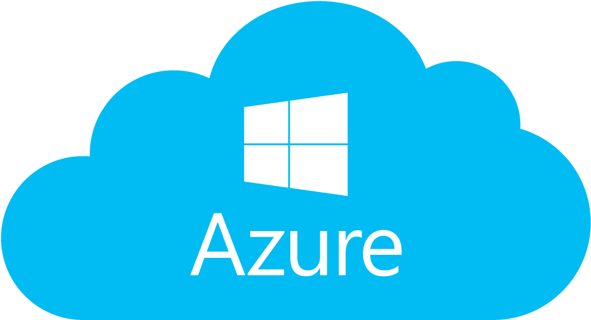

# KuberOptic

###

### A visualization and deployment tool for your Kubernetes cluster
KuberOptic provides a tool that allows developers to visualize the structure of their clusters, including the nodes, pods, and containers. At each level of a cluster, KuberOptic gives you monitoring analytics that describe the health of your application. KuberOptic also allows you to deploy new clusters onto the cloud.

***
## How to Use:
***
### Local Deployment of Kubernetes
First we need a cluster to visualize. We could use minikube to set up a simple cluster.

[KubernetesDocumentation](https://kubernetes.io/docs/tasks/tools/install-minikube/)
### GCP

First create a google developer account and start a project through GCP. Find your credentials on Google and then enter them with the corresponding time zone on the upload page. Your deployed cluster through GCP will now be visualized in real time.
**Prequisites**
- Google Developer account
- create a project on GCP

**Configuring GCP through command line**
```
gcloud auth application-default login
```
**Input Project credentials**
```

```
***
### AWS
**Enter AWS configuration/set-up here**

***
### Azure
**COMING SOON**

### Scripts break-down
**Build project with Webpack**
```
npm run prod
```
**Run in production environment**
```
npm start
```
**Run tests with Jest**
```
npm run test
```
**Build package for mac OS***
```
npm run package-mac
```
**Lint project**
```
npm run lint
```
## Coming Soon
**Stretch Features**
- Deployment to Azure
- Remodeled UI
***
## Authors
[Juan Espinoza](https://github.com/jespinoza17)
[Jacob Banks](https://github.com/jacobbanks)
[Jay Dawson](https://github.com/ImJustJay)
[Jimmy Deng](https://github.com/rev619)
## License
MIT