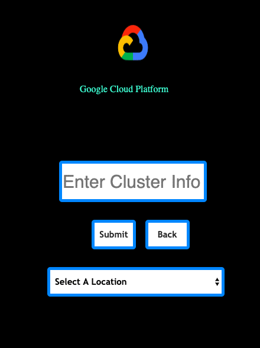
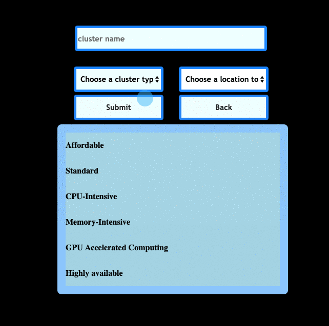
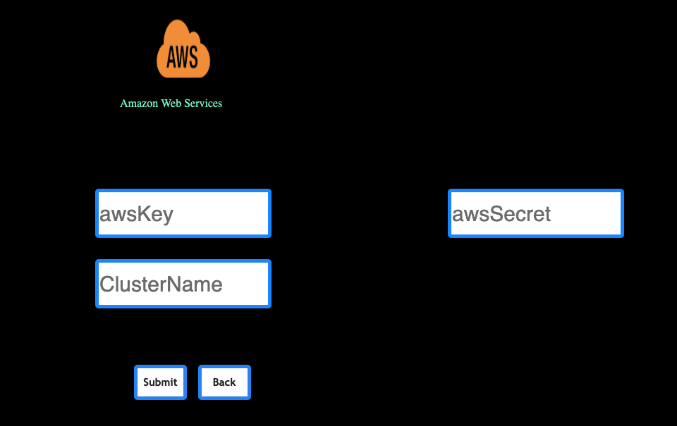

# KuberOptic
###
[KuberOptic](kuberoptic.com)
***

### A visualization and deployment tool for your Kubernetes cluster
###

KuberOptic provides a tool that allows developers to visualize the structure of their clusters, including the nodes, pods, and containers. At each level of a cluster, KuberOptic gives you monitoring analytics that describe the health of your application. KuberOptic also allows you to deploy new clusters onto the cloud.

***
## How to Use:

### Local Deployment of Kubernetes
First we need a cluster to visualize. We could use minikube to set up a simple cluster. This api will automatically scan for whether a cluster is deployed locally and visualize it.

[Kubernetes Documentation](https://kubernetes.io/docs/tasks/tools/install-minikube/)

###Reading clusters from cloud services
***
### GCP
First create a google developer account and start a project through GCP. Find your credentials on Google and then enter them with the corresponding time zone on the upload page. The credientials you get from Google should be in a JSON in the forn of GOOGLE_APPLICATION_CREDIENTIALS. Your deployed cluster through GCP will now be visualized in real time.
**Prequisites**
- Google Developer account
- Create a project on GCP

**Configuring GCP through command line**
```
gcloud auth application-default login
```
**Input Project credentials**

**Deployment (GCP) **

***
### AWS <reading cluster>
Our API utilizes AWS-SDK's EKS(Amazon Elastic Kubernetes Service). Simply go and create an AWS account to generate a secret ID and SecretKey for your IAM account. Enter the Secret ID and Key along with the cluster you want to inspect. As of now, you must specify the cluster name  

***
### Azure
**COMING SOON**
***
**Build project with Webpack**
```
npm run prod
```
**Run in production environment**
```
npm start
```
**Run tests with Jest**
```
npm run test
```
**Build package for mac OS***
```
npm run package-mac
```
**Lint project**
```
npm run lint
```
## Coming Soon
**Stretch Features**
- Deployment to Azure
- Remodeled UI
***
## Authors
[Juan Espinoza](https://github.com/jespinoza17)
[Jacob Banks](https://github.com/jacobbanks)
[Jay Dawson](https://github.com/ImJustJay)
[Jimmy Deng](https://github.com/rev619)
## License
MIT